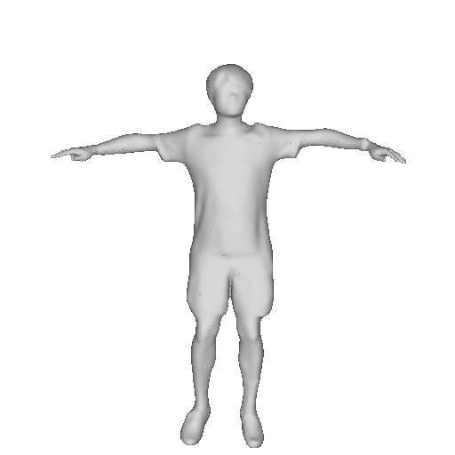

# CHRIS: Clothed Human Reconstruction with Side View Consistency

## Create animatable avatars

### Avatar 01

    
    

 <!-- 用于中间间隔 15% 屏幕宽度 -->
    

    

        <video width="100%" autoplay muted loop>
            <source src="video/H1_Robot_HipHop_dance.mp4" type="video/mp4">
            Your browser does not support the video tag.
        </video>
        
<em>Robot HipHop dance</em>

    

    

        <video width="100%" autoplay muted loop>
            <source src="video/H1_Swimming.mp4" type="video/mp4">
            Your browser does not support the video tag.
        </video>
        
<em>Swimming</em>

    

    

        <video width="100%" autoplay muted loop>
            <source src="video/H1_Throw_Grenade.mp4" type="video/mp4">
            Your browser does not support the video tag.
        </video>
        
<em>Throw Grenade</em>

    

    

        <video width="100%" autoplay muted loop>
            <source src="video/H1_Baseball_Hit.mp4" type="video/mp4">
            Your browser does not support the video tag.
        </video>
        
<em>Baseball Hit</em>

    

    

        <video width="100%" autoplay muted loop>
            <source src="video/H1_Falling_To_Roll.mp4" type="video/mp4">
            Your browser does not support the video tag.
        </video>
        
<em>Falling To Roll</em>

    

    

        <video width="100%" autoplay muted loop>
            <source src="video/H1_Kidney_Hit.mp4" type="video/mp4">
            Your browser does not support the video tag.
        </video>
        
<em>Kidney Hit</em>

    

### Avatar 02

    
    

 <!-- 用于中间间隔 15% 屏幕宽度 -->
    

    

        <video width="100%" autoplay muted loop>
            <source src="video/H2_Falling.mp4" type="video/mp4">
            Your browser does not support the video tag.
        </video>
        
<em>Falling</em>

    

    

        <video width="100%" autoplay muted loop>
            <source src="video/H2_Illegal_Elbow_Punch.mp4" type="video/mp4">
            Your browser does not support the video tag.
        </video>
        
<em>Illegal Elbow Punch</em>

    

    

        <video width="100%" autoplay muted loop>
            <source src="video/H2_Sitting_Thumbs_Up.mp4" type="video/mp4">
            Your browser does not support the video tag.
        </video>
        
<em>Sitting Thumbs Up</em>

    

    

        <video width="100%" autoplay muted loop>
            <source src="video/H2_Spin_In_Place.mp4" type="video/mp4">
            Your browser does not support the video tag.
        </video>
        
<em>Spin In Place</em>

    

    

        <video width="100%" autoplay muted loop>
            <source src="video/H2_Strafe.mp4" type="video/mp4">
            Your browser does not support the video tag.
        </video>
        
<em>Strafe</em>

    

    

        <video width="100%" autoplay muted loop>
            <source src="video/H2_Zombie_Stand_Up.mp4" type="video/mp4">
            Your browser does not support the video tag.
        </video>
        
<em>Zombie Stand Up</em>

    

### Avatar 03

    
    

 <!-- 用于中间间隔 15% 屏幕宽度 -->
    

    

        <video width="100%" autoplay muted loop>
            <source src="video/H3_Fall_Flat.mp4" type="video/mp4">
            Your browser does not support the video tag.
        </video>
        
<em>Fall Flat</em>

    

    

        <video width="100%" autoplay muted loop>
            <source src="video/H3_Hard_Landing.mp4" type="video/mp4">
            Your browser does not support the video tag.
        </video>
        
<em>Hard Landing</em>

    

    

        <video width="100%" autoplay muted loop>
            <source src="video/H3_Jumping_Down.mp4" type="video/mp4">
            Your browser does not support the video tag.
        </video>
        
<em>Jumping Down</em>

    

    

        <video width="100%" autoplay muted loop>
            <source src="video/H3_Seated_Idle.mp4" type="video/mp4">
            Your browser does not support the video tag.
        </video>
        
<em>Seated Idle</em>

    

    

        <video width="100%" autoplay muted loop>
            <source src="video/H3_Running_Jump.mp4" type="video/mp4">
            Your browser does not support the video tag.
        </video>
        
<em>Running Jump</em>

    

    

        <video width="100%" autoplay muted loop>
            <source src="video/H3_Silly_Dancing.mp4" type="video/mp4">
            Your browser does not support the video tag.
        </video>
        
<em>Silly Dancing</em>

    

